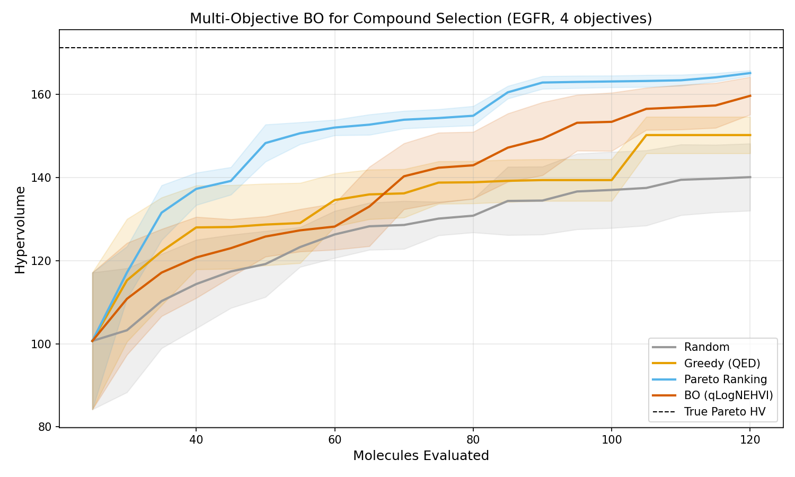
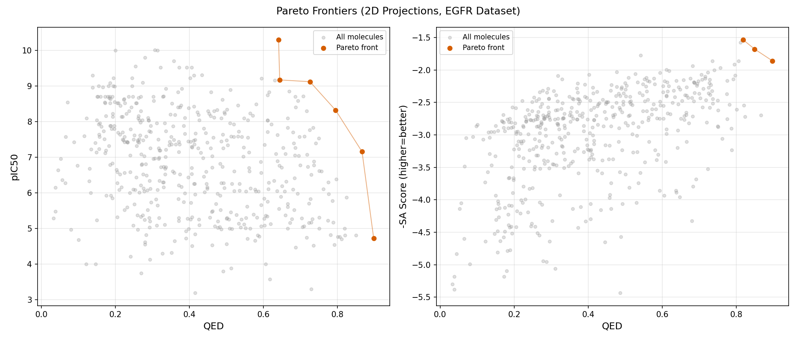

# Pareto Screen

Multi-objective Bayesian optimization for compound selection in drug discovery.

Select which molecules to synthesize from large candidate pools — balancing competing objectives like potency, drug-likeness, and synthetic accessibility under uncertainty.

`pareto-screen` uses Gaussian process surrogate models and multi-objective acquisition functions (qLogNEHVI via BoTorch) to recommend which compounds to prioritize for expensive wet-lab synthesis. Evaluated on real bioactivity data from ChEMBL, it reaches **93% of the true Pareto hypervolume while evaluating only 24% of the candidate pool**.



## The Problem

In early-stage drug discovery, computational methods generate large libraries of candidate molecules. Each candidate has multiple predicted properties — binding affinity, drug-likeness, synthetic accessibility — that often conflict with each other. The compound selection problem is: given N molecules with M competing objectives, which K should we synthesize and test?

Standard approaches (Pareto ranking, weighted scoring) don't account for uncertainty in predicted properties. Bayesian optimization handles this naturally by modeling objectives as distributions and using acquisition functions that balance exploitation with exploration.

## How It Works

`pareto-screen` operates on a finite pool of molecules (the virtual screening setting):

1. **Featurize** molecules via Morgan fingerprints reduced to 50 PCA components
2. **Fit** independent Gaussian process surrogates for each objective
3. **Acquire** the most promising unobserved candidates using qLogNEHVI (log-transformed Noisy Expected Hypervolume Improvement)
4. **Reveal** true objective values for selected molecules (simulating wet-lab evaluation)
5. **Repeat** — the GPs improve with each round of observations

The framework evaluates against baselines (random selection, single-objective greedy, Pareto ranking) on real bioactivity data from ChEMBL, measuring how efficiently it identifies the Pareto frontier with fewer evaluations.

## Results

Benchmark on 500 EGFR compounds from ChEMBL with 4 objectives (QED, SA score, LogP, pIC50), selecting 120 of 500 molecules over 20 iterations:

| Strategy | Hypervolume | % of True Pareto |
|----------|-------------|------------------|
| Random | 140.1 | 81.8% |
| Greedy (best QED) | 150.3 | 87.7% |
| **BO (qLogNEHVI)** | **159.7** | **93.2%** |
| Pareto Ranking* | 165.2 | 96.4% |

\* Pareto Ranking has oracle access to all objective values — an upper bound, not a realistic baseline.

BO reaches 93% of the true Pareto hypervolume while evaluating only 24% of the pool, outperforming random selection by +11.4% and single-objective greedy by +5.5%.



## Design

The framework is agnostic to the upstream scoring engine. It accepts (molecule, objective_value) pairs from any source — physics-based, ML-based, or hybrid. Property predictions with uncertainty estimates improve GP calibration but are not required.

- **PyTorch + BoTorch** for the optimization framework
- **Discrete pool selection** (not continuous optimization) — matches the virtual screening setting where candidates are a finite set
- **Configurable objectives** with direction handling — adding a new objective requires one `ObjectiveConfig` entry
- **Batch selection** — select multiple compounds per iteration, matching parallel synthesis workflows

## Installation

Requires Python >= 3.12 and [uv](https://docs.astral.sh/uv/).

```bash
git clone https://github.com/your-username/pareto-screen.git
cd pareto-screen
uv sync
```

## Usage

### Run the benchmark

```bash
uv run python -m pareto_screen
```

This loads EGFR bioactivity data from ChEMBL, runs BO and baselines, and saves plots to `results/`.

Options:
```
--n-molecules 500    # molecules to sample from ChEMBL
--n-iterations 20    # BO iterations per run
--n-repeats 3        # random seed repeats for statistics
--batch-size 5       # molecules selected per iteration
--n-initial 20       # initial random sample size
--output-dir results # directory for plots
```

### Use as a library

```python
from pareto_screen.data.dataset import MoleculeDataset
from pareto_screen.bo.optimizer import BayesianOptimizer
from pareto_screen.types import ObjectiveConfig

configs = [
    ObjectiveConfig(name="qed", direction="maximize"),
    ObjectiveConfig(name="sa_score", direction="minimize"),
    ObjectiveConfig(name="logp", direction="maximize"),
]

dataset = MoleculeDataset.from_smiles(smiles_list, configs, n_pca_components=20)
X, Y = dataset.get_tensors()

optimizer = BayesianOptimizer(
    objective_configs=configs,
    batch_size=5,
    n_initial=20,
    n_iterations=50,
)
result = optimizer.run(X, Y)
```

### Run tests

```bash
uv run pytest tests/ -v -k "not slow"
```

## Architecture

```
src/pareto_screen/
    types.py              # MoleculeRecord, ObjectiveConfig, ScreeningPool, SelectionStrategy
    data/
        properties.py     # RDKit: QED, SA score, LogP
        featurizer.py     # Morgan fingerprints -> PCA reduction
        chembl.py         # ChEMBL REST API data loading
        dataset.py        # Assembles molecules into BO-ready tensors
    bo/
        pareto.py         # Pareto frontier detection, hypervolume
        surrogate.py      # ModelListGP construction and fitting
        acquisition.py    # qLogNEHVI construction and evaluation
        optimizer.py      # Full BO loop orchestrator
        selector.py       # BOSelector implementing SelectionStrategy
    baselines/
        random.py         # Random selection
        greedy.py         # Single-objective greedy
        pareto_ranking.py # Non-dominated sorting
    evaluation/
        oracle.py         # Holds ground truth, reveals on request
        metrics.py        # Hypervolume, Pareto coverage, efficiency
        benchmark.py      # Runs all strategies comparatively
```

## Tech Stack

| Package | Version | Role |
|---------|---------|------|
| BoTorch | 0.17.2 | Multi-objective Bayesian optimization |
| GPyTorch | 1.15.2 | Gaussian process models |
| PyTorch | 2.11 | Tensor computation |
| RDKit | 2025.9.6 | Molecular property computation |
| scikit-learn | 1.8 | PCA dimensionality reduction |
| matplotlib | 3.10 | Result visualization |
